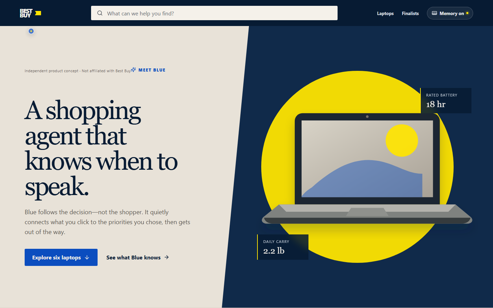
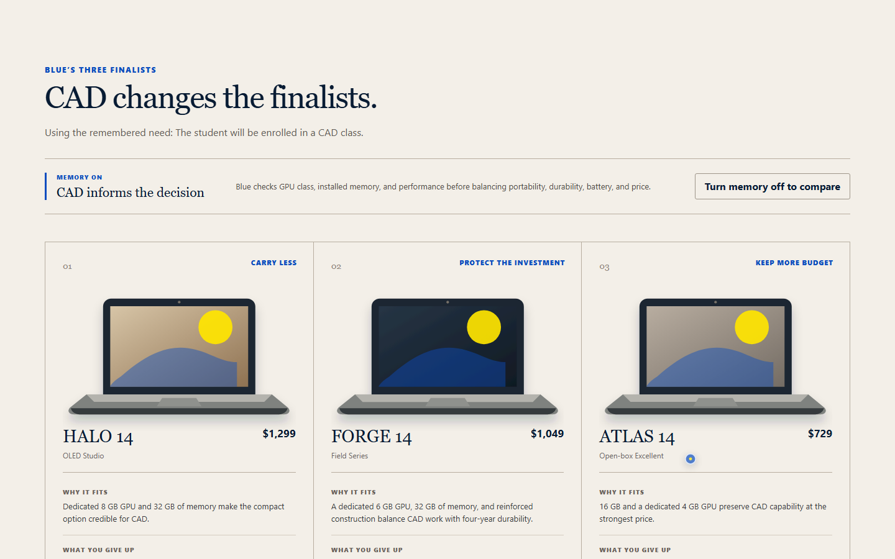

# Blue — Ambient Shopping Agent Concept

An independent, employer-facing product concept exploring what it would look like if a retail AI agent accompanied the decision instead of living in a corner chat panel.

**[Open the live concept demo](https://angry-tacoz.github.io/best-buy-blue-concept/)**

> This project is not affiliated with, endorsed by, or connected to Best Buy. BEST BUY is a trademark of its respective owner. Every product, price, review, condition, and recommendation in this demo is fictional or illustrative.

## Product thesis

Retail assistants often require the shopper to stop browsing, open a panel, and translate their goal into a chat prompt. Blue demonstrates a quieter alternative:

- it comments only after deliberate product interactions;
- it connects one relevant fact to visible shopper priorities;
- it uses no sound or interruption queue;
- it keeps memory inspectable, editable, reversible, and browser-local;
- it presents three different decision directions rather than claiming one universal winner.

The demonstration follows a parent looking for a portable, durable college laptop. The final shortlist preserves three useful tradeoffs: carry less, protect the investment, or preserve more of the budget.





## Privacy and simulation boundary

- Shopping memory is a fictional seeded profile stored only in `localStorage`.
- Nothing is transmitted to Best Buy, an analytics provider, or a model API.
- Recommendations are produced by deterministic local scoring.
- There is no authentication, live catalogue, inventory, checkout, tracking, or purchasing behavior.
- Clearing memory removes the browser entry and disables personalization.

## Run locally

```powershell
npm.cmd install
npm.cmd run dev -- --host 127.0.0.1 --port 4173
```

Open `http://127.0.0.1:4173/` on a desktop or laptop.

## Verification

```powershell
npm.cmd run lint
npm.cmd run typecheck
npm.cmd run test
npm.cmd run build
npm.cmd run test:e2e
```

The workspace-level verification contract is stored in `.codex/verify.json`. CI runs the same lint, type, test, and production-build sequence on pull requests and pushes to `main`.

## Architecture

- React + TypeScript + Vite
- Framer Motion for restrained presence and reveal motion
- Versioned browser-local memory adapter with malformed-state recovery
- Deterministic scoring across portability, durability, battery, performance, value, price, and open-box preference
- One finalist per decision archetype to prevent three nearly identical recommendations
- Original SVG laptop illustrations with no third-party product logos

## What a real implementation would require

A production retailer integration would need authenticated customer consent, a server-enforced preference and retention model, catalogue and inventory APIs, price freshness, evidence provenance, accessibility research, abuse and cost controls for any model endpoint, monitoring, and extensive privacy/legal review. None of that is implied by this front-end concept.

## Intended operating scope

Public, low-risk, static demonstration. Desktop is the supported interaction surface because the core concept depends on pointer presence. Small screens receive an explicit device message instead of a degraded imitation.
